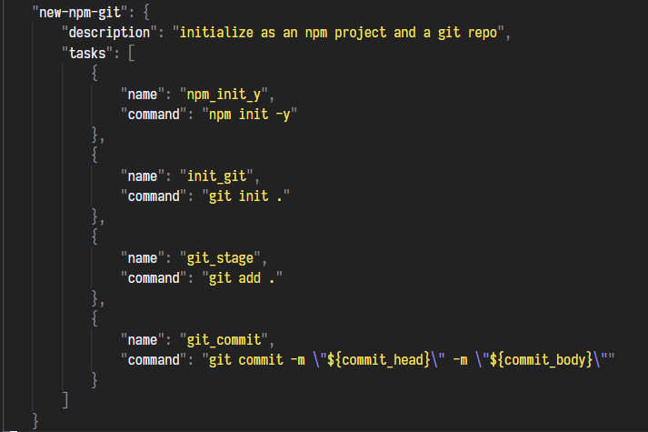
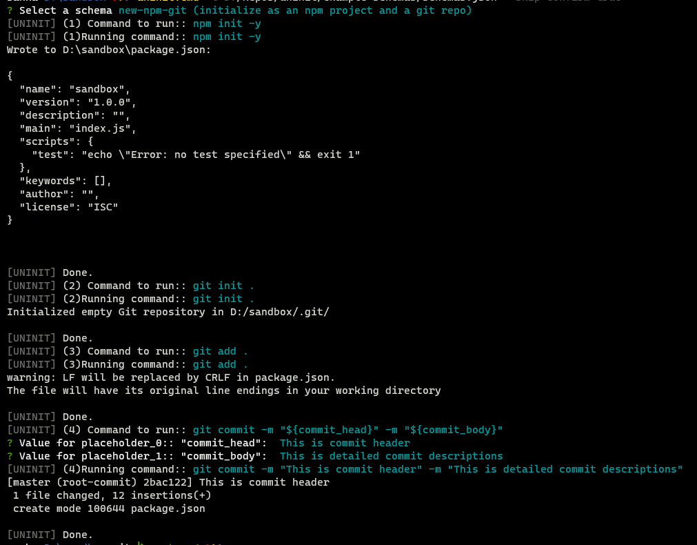
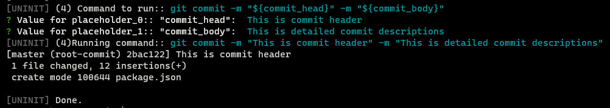

# UNINIT

Or, How to ultra-over-engineer a buggy and useless piece of software

## Why?

Whenever I wanted to setup a new project, I used to always run these commands:

```
npm init -y
```
And,

```
git init .
git add .
git commit -m "Initial commit"
```

So, I thought of automating it.

I thought of writing a tool (FML!) that could execute a series of commands.

## How does it work?

This will basically read a json file that has a `schema` object. This `schema` object should have key-value pairs of schemas.

User can select a schema by passing a cli arg(`-l`) that points to the json file containing schemas key-value pairs:  
  

`--skip-confirm=true` option is passed. Otherwise, user has to confirm the execution of each task.   

A sample schema object. Here, there are `tasks` that will run sequentially. :  
  
  
 

This is how the `task`s are run sequentially.
  

Observe the last task (no. 4). This task's `command` has placeholders
- `${commit_head}` and
- `${commit_body}`


So, the tool will 
- parse the command
- Take the values for each of the placeholder from the user (here, "Value for placeholder_0" in the image)
- Replaces the placeholders with these values
- Executes the replaced command (Here, `git commit -m "This is commit header" -m "This is detailed commit descriptions"`)

## Structure Of Schema (You can skip and go to [PS](#ps))

Each schema has the folowing structure: 

- description(string): Describes the schema
- tasks(Array<{name: string, command: string}>): `name` property is a unique id for this object task object. `command` is the command to execute. `command` can take user inputs. If there is any placeholder in the string(in this form: `${user_input_1}`), then the tool will parse it and asks the user for input for each of the placeholder.  
For example:  
if the `task` object has the value 
```
{
    name: "commit_git"
    command: "git commit -m \"${commit_head}\" \"${commit_body}\""
}
```
then, 
1. the tool will ask the user for the value for `"commit_heade"` and `"commit_body"` sequentially
2. replace the user given value for those inputs and finally execute command similar to this:

```
git commit "My first commit" "This is the start of this project"
```

## PS

You might be thinking,
```
"Why The F, would I ever use this instead of a simple shell script! This is a completely useless piece Of Sh*t!"
```

And, you would be **ABSOLUTELY** right.